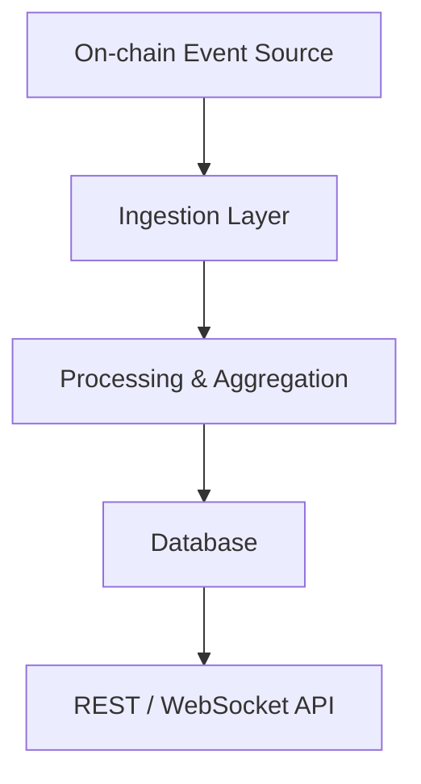

# Architecture

## Components

- **Ingestion**: listens to smart contract events  
- **Processing**: calculates volume, open interest, funding, PnL  
- **Storage**: PostgreSQL schema with tables:
  - `trades`
  - `funding_rates`
  - `open_interest`
- **API Layer**: endpoints for metrics, history, real-time feed
